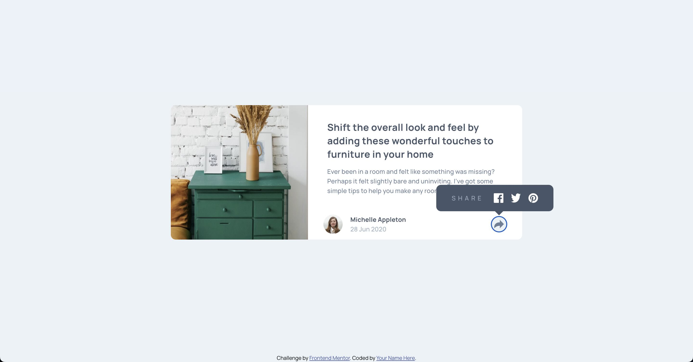

# Frontend Mentor - Article preview component solution

This is a solution to the [Article preview component challenge on Frontend Mentor](https://www.frontendmentor.io/challenges/article-preview-component-dYBN_pYFT). Frontend Mentor challenges help you improve your coding skills by building realistic projects.

## Table of contents

- [Overview](#overview)
  - [The challenge](#the-challenge)
  - [Screenshot](#screenshot)
  - [Links](#links)
- [My process](#my-process)
  - [Built with](#built-with)
  - [What I learned](#what-i-learned)
  - [Continued development](#continued-development)
  - [Useful resources](#useful-resources)
- [Author](#author)

## Overview

Responsive layout for mobile and desktop version with interactivity for share button. Built with best accessibility practice.

### The challenge

Users should be able to:

- View the optimal layout for the component depending on their device's screen size
- See the social media share links when they click the share icon

### Screenshot



### Links

- Solution URL: [https://github.com/NikitaVologdin/Article-preview-component](https://github.com/NikitaVologdin/Article-preview-component)
- Live Site URL: [https://article-preview-component-wheat-eight.vercel.app/](https://article-preview-component-wheat-eight.vercel.app/)

## My process

I decided to remove padding bottom from article for now. because have not found way how to match "share arrow icon" with block which appears after click on button and align that icon with content in appearing block. Unfortunately if add same padding-bottom value to the block in creates disproportional look for content vertical alignment.

### Built with

- Semantic HTML5 markup
- CSS custom properties
- Flexbox
- CSS Grid
- Mobile-first workflow
- Vanilla JS

### What I learned

I learned that buttons should contain inner text explaining what happen if user clicks on the button. It is needed for screen readers. And one of the ways to hide text or element for users and keep it visible for screen readers.

```css
.element-invisible {
  position: absolute !important;
  height: 1px;
  width: 1px;
  overflow: hidden;
  clip: rect(1px 1px 1px 1px);
  clip: rect(1px, 1px, 1px, 1px);
}
```

### Continued development

I want to find out more about accessibility

### Useful resources

- [https://developer.mozilla.org/en-US/docs/Web/HTML/Element/button#accessibility](https://developer.mozilla.org/en-US/docs/Web/HTML/Element/button#accessibility) - Explaining how button how button works for screen readers.
- [https://snook.ca/archives/html_and_css/hiding-content-for-accessibility](https://snook.ca/archives/html_and_css/hiding-content-for-accessibility) - Article about how to hide element for users and save for screen readers.

## Author

- Website - [Nikita Vologdin](https://vologdin.eu/portfolio)
- Frontend Mentor - [@NikitaVologdin](https://www.frontendmentor.io/profile/NikitaVologdin)
